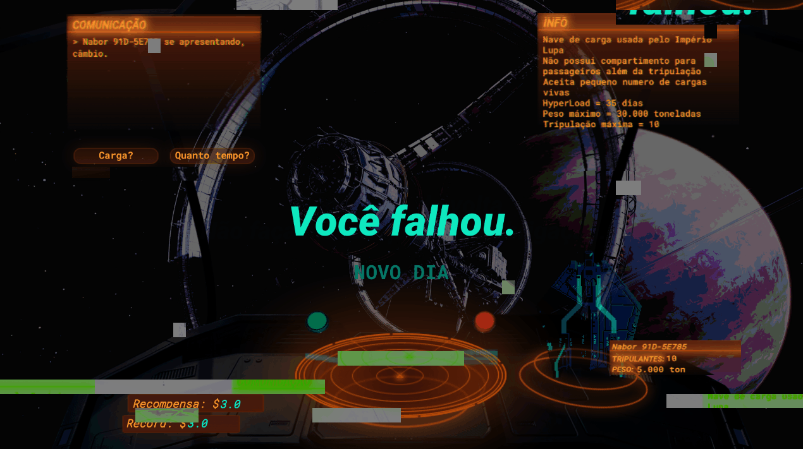

# Zum01

**Zum01** is a space border control simulation point-and-click game. It´s Papers Please, IN SPACE.
It is was made completely in the game engine Unity with **third party** assets.

The game happens in a space station, where the main character works for the Lupa empyre and must permit or deny the passage of spaceshits, based on the information they give to the character during the game.

